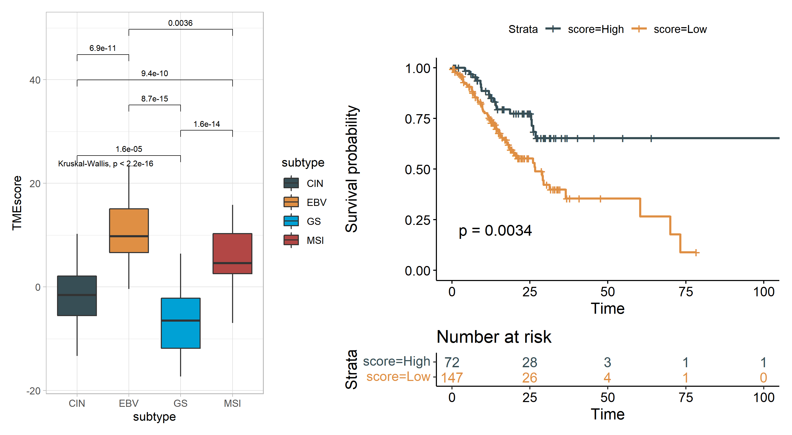

<!-- README.md is generated from README.Rmd. Please edit that file -->

# TMEscore

### 1.Introduction

TME infiltration patterns were determined and systematically correlated
with TME cell phenotypes, genomic traits, and patient
clinicopathological features to establish the
[TMEscore](https://cancerimmunolres.aacrjournals.org/content/7/5/737):Tumor
Microenvironment Characterization in Gastric Cancer Identifies
Prognostic and Immunotherapeutically Relevant Gene Signatures.

TMEscore is an R package to perform tumor microenvironment analysis.
Main advantages: 1. Provides functionality to calculate Tumor
microenvironment (TME) score (PCA or z-score) 2. Functions to visualize
TME data. 3. Identify TME relevant mutations.

### 2.Installation

The package is not yet on CRAN. You can install from Github:

``` r
# install.packages("devtools")
if (!requireNamespace("TMEscore", quietly = TRUE))
  devtools::install_github("DongqiangZeng0808/TMEscore")
```

### 3.Usage

Main documentation is on the `tmescore` function in the package:

``` r
library('TMEscore')
#> Loading required package: survival
#> Loading required package: survminer
#> Loading required package: ggplot2
#> Loading required package: ggpubr
#> TMEscore v0.1.3  For help: https://github.com/DongqiangZeng0808/TMEscore
#> 
#>  If you use TMEscore in published research, please cite:
#>  --------------------------------
#>  Tumor microenvironment characterization in gastric cancer identifies prognostic and imunotherapeutically relevant gene signatures.
#>  Cancer Immunology Research, 2019, 7(5), 737-750
#>  DOI: 10.1158/2326-6066.CIR-18-0436 
#>  PMID: 30842092
#>  --------------------------------
#>  Tumor microenvironment evaluation promotes precise checkpoint immunotherapy of advanced gastric cancer.
#>  Journal for ImmunoTherapy of Cancer, 2021, 9(8), e002467
#>  DOI: 10.1136/jitc-2021-002467
#>  PMID: 34376552
```

Example

``` r
tmescore<-tmescore(eset = eset_stad, #expression data
                   pdata = pdata_stad, #phenotype data
                   method = "PCA", #default
                   classify = T) #if true, survival data must be provided in pdata
head(tmescore)
#>               ID subtype   time status TMEscoreA TMEscoreB  TMEscore
#> 284 TCGA-RD-A8N2    <NA> 118.00      0 -6.705998  11.66689 -18.37289
#> 95  TCGA-BR-A4IV      GS  28.97      1 -6.376907  10.91756 -17.29446
#> 66  TCGA-BR-8371      GS  11.97      1 -6.258413  10.94738 -17.20580
#> 69  TCGA-BR-8380      GS     NA      1 -5.213597  11.38528 -16.59887
#> 101 TCGA-BR-A4J9      GS   0.47      0 -5.463828  10.55516 -16.01899
#> 82  TCGA-BR-8592      GS   6.37      1 -5.003108  10.84967 -15.85278
#>     TMEscore_binary
#> 284             Low
#> 95              Low
#> 66              Low
#> 69              Low
#> 101             Low
#> 82              Low
```

``` r
#remove observation with missing value
tmescore<-tmescore[!is.na(tmescore$subtype),]

p<-ggplot(tmescore,aes(x= subtype,y=TMEscore,fill=subtype))+
  geom_boxplot(notch = F,outlier.shape = 1,outlier.size = 0.5)+
  scale_fill_manual(values= c('#374E55FF', '#DF8F44FF', '#00A1D5FF', '#B24745FF'))

comparision<-combn(unique(as.character(tmescore$subtype)), 2, simplify=F)

p+theme_light()+stat_compare_means(comparisons = comparision,size=3.5)+stat_compare_means(size=3.5)
```



### Citation

If you use TMEscore in published research, please cite:

1.  [Tumor microenvironment evaluation promotes precise checkpoint
    immunotherapy of advanced gastric
    cancer](https://jitc.bmj.com/content/9/8/e002467). Journal for
    ImmunoTherapy of Cancer, 2021, 9(8), e002467. DOI:
    10.1136/jitc-2021-002467, PMID: 34376552

2.  [Tumor microenvironment characterization in gastric cancer
    identifies prognostic and imunotherapeutically relevant gene
    signatures](https://cancerimmunolres.aacrjournals.org/content/7/5/737).
    Cancer Immunology Research, 2019, 7(5), 737-750. DOI:
    10.1158/2326-6066.CIR-18-0436, PMID: 30842092 and

### Contact

E-mail any questions to <dongqiangzeng0808@gmail.com>
